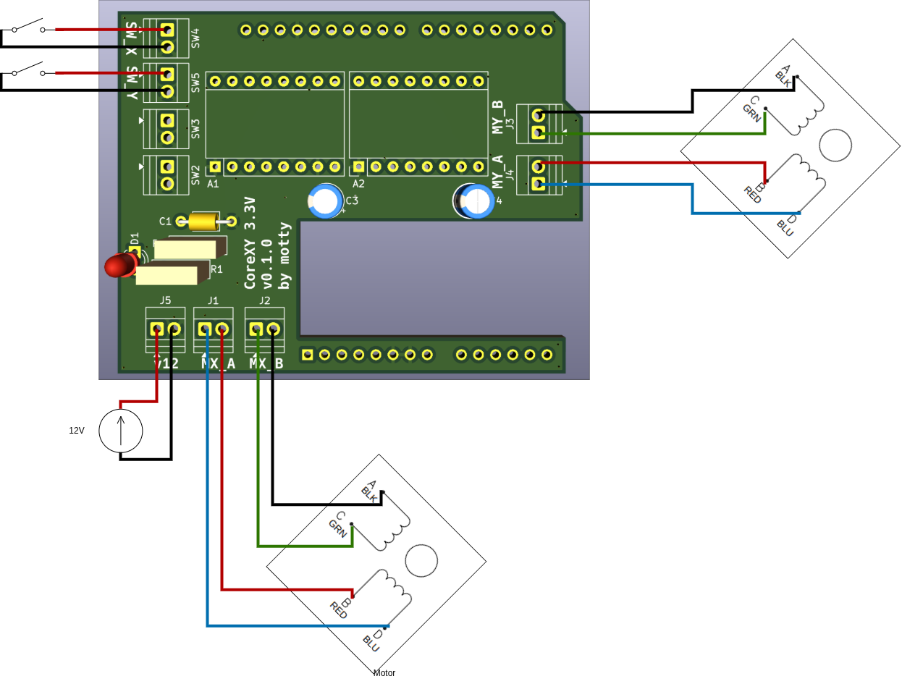

# Klask PCB

このリポジトリには、ボードゲーム「Klask（クラスク）」を操作するためのステッピングモーターおよびリミットスイッチを制御する、Arduino Uno R3用カスタムシールド **Klask PCB** のKiCadプロジェクトファイルが含まれています。

## 概要

**Klask PCB** は、ボードゲーム「Klask」の自動化またはロボット化を目的としたハードウェアインターフェース基板です。ステッピングモーターを使用して、盤面の下からゲーム用磁石（操作コマ）を動かします。

このシールドは、Pololu互換ピン配置の DRV8825 ステッピングモータードライバーモジュールを2基搭載してX軸およびY軸のモーターを駆動し、原点復帰用のリミットスイッチ信号を処理して座標のキャリブレーション（原点合わせ）を行います。また、USB-PD トリガーモジュールから供給される12V外部電源の接続状態を検出する電源検出（Power Sense）回路も搭載しています。

---

## 主な機能

- **2軸モーター制御**: X軸・Y軸用に2基の DRV8825 ステッピングモータードライバーモジュールを搭載可能。
- **原点復帰（ホーミング）対応**: X軸およびY軸のリミットスイッチ入力端子を備え、起動時に原点（0点）合わせが可能。
- **USB-PDによる12V給電**: USB-PD トリガーモジュール（12V出力設定）から外部12V電源を効率的に供給。
- **電源接続検出 (Power Sense)**: 分圧抵抗とノイズ低減用フィルタ回路により、モーター用12V電源の通電状態を Arduino の `D10` ピンで安全に検出可能。
- **インジケータLED**: 12V電源の通電状態を視覚的に表示するLED表示灯。
- **最小限のピン割り当て**: Arduino Uno R3 との接続には Digital 側のピンヘッダ（10ピン、8ピン）のみを使用し、不要な接続や干渉を最小限に抑えた設計。

---

## 部品表 (BOM)

基板の組み立てに必要な部品リストは以下の通りです。READMEの途中に記載しています。

| 部品名 | 基準符号 (Designator) | 個数 | 説明 / フットプリント |
| --- | --- | --- | --- |
| **DRV8825 ステッピングモータードライバーモジュール** | A1, A2 | 2 | Pololu互換ブレークアウトボード型 |
| **Arduino UNO R3** | A3 | 1 | マイコンボード（ベース基板） |
| **USB-PD トリガーモジュール** | — | 1 | 12V出力設定のもの |
| **10ピン ピンヘッダ** | — | 1 | 2.54mm ピッチ（Arduino Digital High側接続用） |
| **8ピン ピンヘッダ** | — | 1 | 2.54mm ピッチ（Arduino Digital Low側接続用） |
| **8ピン ピンソケット** | — | 4 | 2.54mm ピッチ（DRV8825モジュール実装用） |
| **LED** | D1 | 1 | 3mm THT LED（12V電源表示灯） |
| **2.54mm ターミナルブロック** | J1, J2, J3, J4, J5, SW4, SW5 | 7 | XY308-2.54-2P（MotXA, MotXB, MotYA, MotYB, 12V, SWX, SWY用） |
| **510 Ω 抵抗器** | R1 | 1 | THT抵抗器（LED電流制限用） |
| **180 Ω 抵抗器** | R2 | 1 | THT抵抗器（電源検出分圧用） |
| **0.1 µF コンデンサ** | C1 | 1 | 積層セラミックコンデンサ THT（電源検出ノイズフィルタ） |
| **100 µF 電解コンデンサ** | C3, C4 | 2 | 電解コンデンサ THT（モーター電源デカップリング用） |

*※注意: 基板レイアウト上にはUI拡張用の SW2 (SW_A) および SW3 (SW_B) のパターンがありますが、本ビルドでは実装しません。*

---

## ピン配置 (Pin Mapping)

Arduino Uno R3 のデジタルピンと、モータードライバー、リミットスイッチ、および電源検出回路の接続対応表です。

### ステッピングモータードライバー (DRV8825)
| 信号名 | Arduinoピン | DRV8825ピン | 説明 |
| --- | --- | --- | --- |
| `/MX_STEP` | `D8` | `STEP` (A1) | X軸ステップ制御パルス |
| `/MX_DIR` | `D9` | `DIR` (A1) | X軸回転方向指定 |
| `/MY_STEP` | `D4` | `STEP` (A2) | Y軸ステップ制御パルス |
| `/MY_DIR` | `D5` | `DIR` (A2) | Y軸回転方向指定 |
| `/nEN` | `D3` | `~{RST}`, `~{SLP}` (A1, A2) | ドライバーイネーブル（リセット/スリープ共通制御） |
| `/M0` | `D0 / RX` | `M0` (A1, A2) | マイクロステップ設定ビット 0 |
| `/M1` | `D1 / TX` | `M1` (A1, A2) | マイクロステップ設定ビット 1 |
| `/M2` | `D2` | `M2` (A1, A2) | マイクロステップ設定ビット 2 |

### リミットスイッチ & センサ入力
| 信号名 | Arduinoピン | 基板コネクタ | 説明 |
| --- | --- | --- | --- |
| `/SW_X` | `A5` (Digital I/O) | `SW4` | X軸原点リミットスイッチ（アクティブロー） |
| `/SW_Y` | `A4` (Digital I/O) | `SW5` | Y軸原点リミットスイッチ（アクティブロー） |
| `GND` | `GND` | `SW4`, `SW5` | スイッチ用共通グランド |

### 電源接続検出 & フィードバック
| 信号名 | Arduinoピン | 関連部品 | 説明 |
| --- | --- | --- | --- |
| `/A0` | `D10` | `D1`, `R1`, `R2`, `C1` | 12V外部電源が接続されているかを検知するピン（HIGH = 12V通電中） |

---

## 接続と組み立て

1. **端子台 (Terminal Blocks) の配線**:
   - **`J5` (12V入力)**: **USB-PD トリガーモジュール**からの 12V出力（12VおよびGND）を接続します。
   - **`J1` & `J2`**: X軸ステッピングモーターのコイル（相Aを `J1`、相Bを `J2`）に接続します。
   - **`J3` & `J4`**: Y軸ステッピングモーターのコイル（相Aを `J3`、相Bを `J4`）に接続します。
   - **`SW4` & `SW5`**: それぞれX軸およびY軸のリミットスイッチ（衝突検知・原点復帰用）に接続します。
2. **Arduino Unoへの取り付け**:
   - シールドのデジタルピン側に、10ピンと8ピンのピンヘッダ（オス）を半田付けします。
   - 電源検出回路用の部品（`D1`, `R1`, `R2`, `C1`）およびデカップリングコンデンサ（`C3`, `C4`）を半田付けします。
   - 完成したシールドを Arduino Uno R3 にスタック（ドッキング）させます。
3. **モータードライバーの実装**:
   - モジュール受用のピンソケット（8ピン×4個）をシールド上に半田付けします。
   - DRV8825 ステッピングモータードライバーモジュールをソケットに挿入します。向き（VMOT/GNDピンの位置）が正しいか必ず確認してください。

---

## ライセンス

本プロジェクトは **CC BY-SA 4.0** (Creative Commons Attribution-ShareAlike 4.0 International) ライセンスのもとで公開されています。適切なクレジットを表記し、改変したものも同一のライセンスで配布することを条件に、自由な共有・複製・改変が認められています。
